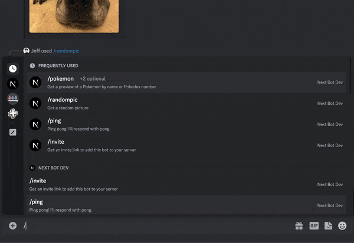

# NextBot: Next.js Discord Bot Template

NextBot is a Discord bot template built with Next.js and configured to run at the Edge. It's designed to be simple to setup and deploy — you should be able to get started with NextBot in <5 minutes!

- Runs in Edge Runtime: Lightning-fast responses with no cold starts, plus more generous free tier than serverless.
- Free & easy to deploy: Deploy to Vercel in seconds at no cost. No need to host a server or VM to run your bot! Don't
  bother with Heroku, EC2, etc.
- Extensible and scalable: Leverage Next.js to create a corresponding web app for your bot, or use features like [next/og](https://vercel.com/docs/functions/edge-functions/og-image-generation) to generate
  dynamic images!

## Try it out

Join the [Demo Server](https://discord.gg/NmXuqGgkb3) to try out NextBot. Here are some commands I've added to the demo bot as an example
of what you can build!

| Command      | Description                                                                                                                    |
| ------------ | ------------------------------------------------------------------------------------------------------------------------------ |
| `/pokemon`   | Returns an image that contains a Pokemon's sprite, name, and pokedex number. The image is generated dynamically using `next/og`. |
| `/ping`      | Ping pong! The bot will respond with "Pong".                                                                                   |
| `/invite`    | Returns a link to invite the bot to your own server.                                                                           |
| `/randompic` | Returns a random picture.                                                                                                      |

Or add NextBot to your own server with this link:
https://discord.com/api/oauth2/authorize?client_id=837427503059435530&permissions=2147485696&scope=bot%20applications.commands

You can also send slash commands to the bot via DM as long as you're in a mutual server with the it!

- [Development](#development)
  - [Setup](#setup)
  - [Local Development](#local-development)
- [Deploy to Production](#deploy-to-production)
- [How It Works](#how-it-works)
  - [File Structure](#file-structure)
- [Why Next.js (instead of Express, serverless, or Cloudflare Workers)?](#why-nextjs-instead-of-express-serverless-or-cloudflare-workers)

## Development

See https://nextjs.org/docs/getting-started/installation for minimum requirements.

### Setup

These steps only need to be done once.

- Clone the repo. This is a
  [template repository](https://docs.github.com/en/repositories/creating-and-managing-repositories/creating-a-repository-from-a-template)
  so you can click the green "Use this template" button on GitHub to create your own repo!
- Run `yarn` to install dependencies.
- [Create a new Discord application](https://discord.com/developers/applications).
  - In the `Bot` settings of your Discord application, enable the `Message Content` intent.
- Fill out environment variables:
  - In the root of the repository, copy `.env.local.example` into a new file `.env.local`. Fill out the values using the
    real values from your Discord app.
- Register some slash commands for your bot. I've included a script to register the commands included in the demo bot.
  - Run `yarn register-commands` to execute the script! You only need to run this once, unless you add new commands.
  - You can learn more about registering commands in the
    [Discord API docs](https://discord.com/developers/docs/interactions/application-commands#create-global-application-command)

### Local Development

Once you've completed the setup steps above, you're ready to run the bot locally!

Discord can only send events to a public `https` address. You'll need an HTTP tunneling service like
[ngrok](https://ngrok.com/) or [Cloudflare Tunnel](https://www.cloudflare.com/products/tunnel/) when developing locally.
For this guide, I'll be using ngrok.

- Run `yarn dev` to start the Next.js application.
- Assuming you're using ngrok, run `ngrok http 3000` to start your HTTP tunnel.
- In the Discord app settings, set `Interactions Endpoint URL` to `<YOUR_PUBLIC_TUNNELED_NGROK_URL>/api/interactions`.
  Make sure to use the `https` URL!
- Save changes in the Discord app settings.
- Set the value of `ROOT_URL` in `.env.local` to your ngrok URL.

In order to verify your interactions endpoint URL, Discord will send a `PING` message to your bot, and the bot should
reply with a PONG (see `src/pages/api/interactions.ts`). If this is successful, your bot is ready to go!

You can now add your bot to your Discord server and try it out! Use Discord's URL generator in `OAuth2 -> URL Generator`
of your Discord app's settings to generate an invite link. Make sure to select:

- `bot` + `applications.commands` for scopes
- `Send Messages` + `Use Slash Commands` for bot permissions

After adding the bot to a server, try out one of the slash commands like `/ping` or `randompic`!

- You can try modifying the response of the `/ping` command and the changes should be reflected immediately.
- You're ready to add your own commands!

Note: whenever you terminate/restart your ngrok tunnel, you'll need to update the `Interactions Endpoint URL` in the
Discord app settings accordingly.

## Deployment

This project is designed to be deployed on Vercel. I recommend that you create a new Discord Application for your production application! This makes it easier to test local changes.

Here are some things you should remember to do when deploying:

- Set the environment variables in Vercel accordingly.
- Set `<YOUR_VERCEL_URL>/api/interactions` as the `Interactions Endpoint URL` in your production Discord app.
- Register commands for the production bot. You can still use `yarn register-commands`, as long as you temporarily update
  `.env.local` on your local machine with the correct values.

Of course, you don't have to use Vercel. Any platform that supports Next.js should work!

## How It Works

Unlike traditional Discord bots which maintain a persistent connection with Discord (and thus require managing your own
servers), NextBot uses Discord's
[Interactions Endpoint](https://discord.com/developers/docs/interactions/slash-commands#receiving-an-interaction) to
respond to interactions (such as slash commands).

The Interactions Endpoint is now Discord's recommended approach to building bots. If you haven't already, I recommend
you read the [Getting Started](https://discord.com/developers/docs/getting-started) and
[Receiving and Responding](https://discord.com/developers/docs/interactions/receiving-and-responding) pages of Discord's
documentation to learn more about Interactions, Slash Commands, and Discord bots!

And be sure to check out the rest of the Discord docs to see all the awesome stuff you can do aside from basic Slash
commands!

### File Structure

- `src/app/api/interactions/route.ts`: This is the main route handler for the Interactions Endpoint. It receives
  interactions from Discord and handles them accordingly.
- `src/discord/verify-incoming-request.ts`: Helper functions to verify incoming requests from Discord, as outlined in
  https://discord.com/developers/docs/interactions/receiving-and-responding#security-and-authorization.
- `src/app/page.tsx`: A basic web page. This could be your admin portal or whatever you'd like!

## Why Next.js (instead of Express, serverless, or Cloudflare Workers)?

NextBot leverages Next.js [Route Handlers](https://nextjs.org/docs/app/building-your-application/routing/route-handlers)
to receive and respond to interactions. But why Next.js specifically — couldn't we host a typical node app on AWS Lambda?

- Next.js is a full web-app framework, making it easy to build an accompanying web app to go along with your Discord
  app. An example of this can be seen in `src/app/page.tsx`.
- You can use Next.js features like [@vercel/og](https://vercel.com/docs/functions/edge-functions/og-image-generation).
  The `/pokemon` command demonstrates this! It generates a dynamic image at runtime, and responses are cached at the
  edge.
- Compared to serverless (i.e. AWS Lambda), edge is faster (no cold start) and cheaper (edge has a more generous free
  tiers and is cheaper per request)
- Vercel scales out very effectively for a more complex Discord bot, for example if you need to add analytics, logging,
  auth, etc.

Note: Discord's official docs include a
[full tutorial for hosting a Discord bot on Cloudflare Workers](https://discord.com/developers/docs/tutorials/hosting-on-cloudflare-workers).
This is the best comparison to NextBot: Next's edge runtime is built on Cloudflare Workers!

In the `/pokemon` command, I demonstrate some of the powerful Next.js features that can use!

- The image in the response is generated dynamically using
  [next/og](https://nextjs.org/docs/app/building-your-application/optimizing/metadata#dynamic-image-generation).
- Requests to [PokeAPI](https://pokeapi.co/) are [cached automatically](https://nextjs.org/docs/app/building-your-application/data-fetching/fetching-caching-and-revalidating) by Next.js
- The dynamic image itself is also cached, so it only needs to be generated once.
